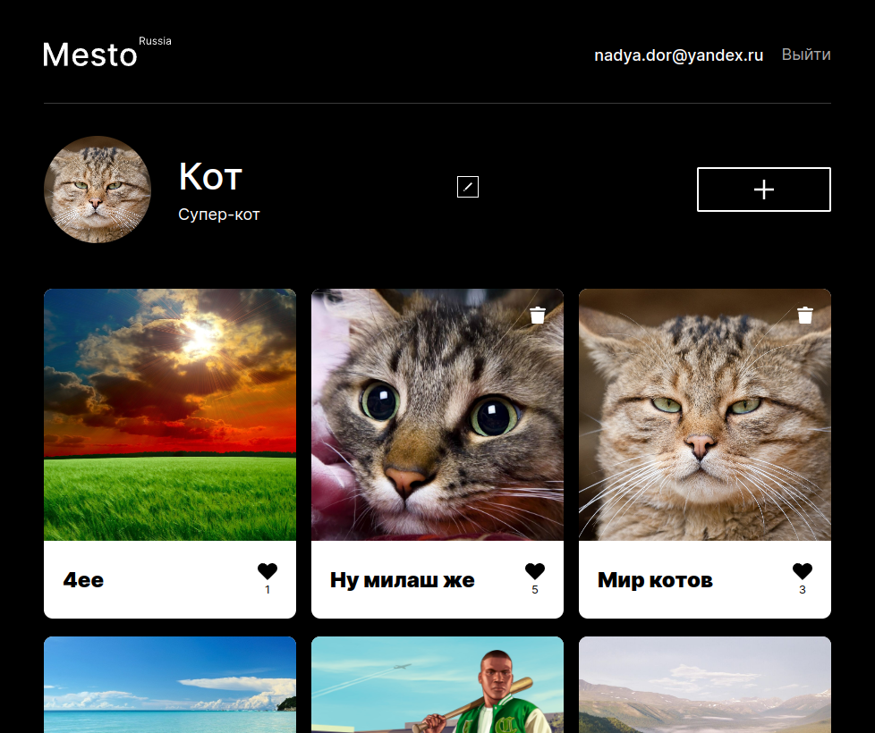

  <b align="center" >Добро пожаловать! Это мой третий проект, созданный в рамках обучения на курсе веб-программист</b>
  <b align="center" >Я.Практикума</b>

  Это приложение-аналог социальной сети для размещения фотографий.
  Данный репозиторий включает в себя фронтенд и бэкенд части приложения со следующими возможностями: авторизации и регистрации пользователей, операции с карточками и пользователями.

  Проект выполнен согласно макету из <a href="https://www.figma.com/file/2cn9N9jSkmxD84oJik7xL7/JavaScript.-Sprint-4?node-id=0%3A1" title="Ссылка на проект в Figma">Figma</a> .

## Директории

`backend/` — папка с файлами бэкенда  
`frontend/` — папка с файлами фронтенда   

`Стек:`

  <h4 align="center" >Приложение опубликавано на Vercel-pages - <a href="https://mesto-react-auth-brown.vercel.app/" title="Ссылка на Vercel Pages">ссылка</a>.</h4>
  
Не забудьте нажать "Открыть в новой вкладке" :wink: 

  

## Этапы выполнения проекта

Проект выполнялся в несколько этапов:

<h3>1. Первый этап длился 12 недель и было осуществлено следующее:</h3>

* Создание и разметка проекта с применением HTML и CSS
* Открытие и закрытие всплывающих окон
* Загрузка данных в форму редактирования профиля

* Создание списка карточек из массива
* Добавление новой карточки через форму
* Расширение функционала карточки: лайк, просмотр, корзина.

* Проверка вводимых данных пользователем перед отправкой формы
* Закрытие окна формы: клавиатурой, кликом мыши на свободном месте.
* Использование классов валидации и карточек

* Подключение модулей в JS
* Преобразование оставшихся модулей в классы
* Сборка проекта Вебпаком

* Смена аватара пользователя
* Удаление карточки с запросом подтверждения
* Загрузка информации на сервер с отслеживанием состояния запросов

<h4>Код опубликован в репозитории - <a href="https://github.com/NadyaDor/mesto" title="Ссылка на Github">ссылка</a>.</h4>

<h4>Приложение опубликавано на Git-pages - <a href="https://nadyador.github.io/mesto/" title="Ссылка на Git Pages">ссылка</a>.</h4>

<h3>2. На втором этапе, который длился 4 недели, фронтент приложения был разработан с помощью фреймворка React:</h3>

* Создание React проекта
* Портирование кода, адаптация всплывающих окон
* Настройка работы Api для react-версии

* Использование контекста и провайдера
* Рефакторинг профиля и карточек
* Сохранение данных в Api

<h4>Код опубликован в репозитории - <a href="https://github.com/NadyaDor/mesto-react" title="Ссылка на Github">ссылка</a>.</h4>

<h4>Приложение опубликавано на Git-pages - <a href="https://nadyador.github.io/mesto-react/" title="Ссылка на Git Pages">ссылка</a>.</h4>

<h3>3. На третем этапе, который длился 2 недели, осуществлено следующее:</h3>

* Реализация логики аутентификации и обработки ошибок
* Использование Routes и Navigate
* Работа с токенами

Код размещен в репозитории по адресу: https://github.com/NadyaDor/mesto-react-auth

<h4>Код опубликован в репозитории - <a href="https://github.com/NadyaDor/mesto-react-auth" title="Ссылка на Github">ссылка</a>.</h4>

<h4>Приложение опубликавано на Vercel-pages - <a href="https://mesto-react-auth-brown.vercel.app/" title="Ссылка на Vercel Pages">ссылка</a>.</h4>

<h3>4. В следубщие 6 недель был написан бэкенд c помощью фреймворка Express:</h3>

* Создание проекта
* Подключение к MongoDB
* Создание схемы и модели
* Создание контроллеров и роутов для пользователей и карточек
* Обработка ошибок

* Создание мидлвэра для авторизации
* Защита Api авторизацией
* Реализация централизованной обработки ошибок
* Валидация приходящих на сервер запросов
* Валидация данных на уровне схемы
* Реализация логирования запросов и ошибок

* Объединение фронтенд и бэкенд частей приложения
* Создание облачного сервера и развертывание Api
* Создание .evn-файла на сервере
* Создание домена и прикрепление его к серверу
* Выпуск и подключение сертификатов
* Краш-тест сервера

<h4 align="center" >Код бэкенда опубликован в репозитории - <a href="https://github.com/NadyaDor/mesto-express-gha" title="Ссылка на Github">ссылка</a>.</h4>

**Краткое резюме**:
Создание аналога социальной сети с чистого листа до размещения готового приложения на хостинг - это очень интересный опыт. По началу было сложно перестроиться c освоенного ванильного JS на работу с фреймворком. Но этот важный этап для меня теперь пройден.
